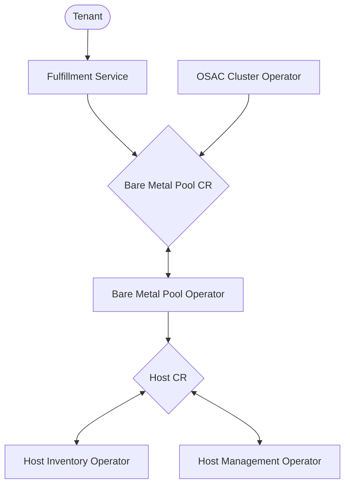

# Bare Metal Fulfillment

## Summary

Bare metal fulfillment refers to the process through which bare metal hosts are acquired and configured. Requests for bare
metal fulfillment could be triggered by an O-SAC tenant, or by a provider workflow, or by other O-SAC fulfillment processes
(such as cluster fulfillment).

## Motivation

O-SAC requires the manipulation of bare metal, whether for cluster fulfillment or agent provisioning or to satisfy tenant
requests. Bare metal fulfillment provides a unified API for this manipulation while also giving us a single point
of integration with backend bare metal inventory and management systems.

### User Stories

* As an O-SAC developer, I want a bare metal fulfillment architecture that allows support for multiple bare metal backends
* As an O-SAC developer, I want to utilize bare metal fulfillment in workflows such as cluster fulfillment
* As a provider, I want to specify bare metal workflows for both internal and tenant use
* As a provider, I want to track bare metal usage for reporting and billing purposes
* As a provider, I want to utilize bare metal fulfillment in workflows such as agent provisioning
* As a tenant, I want to utilize bare metal fulfillment to acquire and configure hardware

### Goals

We will implement a bare metal fulfillment architecture that has the following features:

* Enables support for multiple bare metal backends
* Allows providers to specify bare metal workflows that automate bare metal configuration (such as image provisioning)
* Usable by tenants, providers, and within other O-SAC fulfillment workflows (such as cluster fulfillment)
* Tracks host assignment for reporting and billing purposes

### Non-Goals

* This proposal does not implement bare metal networking; instead, it assumes the existence of an O-SAC Networking API that can be utilized when configuring networking for bare metal hosts.
* This proposal does not implement serial console access to bare metal hosts.
* This proposal does not accommodate a single O-SAC environment with multiple bare metal inventories (although the architecture is designed to support this feature in the future).

## Proposal

We propose creating the following CRDs:

* **Bare Metal Pool:** A bare metal pool represents a collection of bare metal hosts which share a common desired configuration. It specifies two items:
  * **Host Sets:** A collection of desired hosts
  * **Profile:** A configuration that specifies how the bare metal pool should behave. It specifies additional restrictions when selecting hosts, the template that should be applied to the bare metal pool, and the template that should be applied to each host.
  * **Bare Metal Pool Template:** An Ansible role that details setup and teardown steps for a bare metal pool as a whole. Can be written so

* **Host Lease:** Represents a lease on a host; an ephemeral resource that can be used to manipulate the host after acquisition, and which can be safely deleted when the host is released.
  * **Host Class:** Specifies how a host can be managed (OpenStack, Carbide, etc). Each Host is associated with one Host Class.
  * **Host Type:** Describes the type of hardware represented by this host. Analogous to "instance type" in AWS or "resource class" in Ironic. E.g. `fc430`, `h100`
  * **Host Template:** An Ansible role that details setup and teardown steps for an individual host. These steps will typically modify a HostLease's `spec` to manage provisioning, power state, and/or network attachment.

These CRDs will be managed by the following operators:

* **Bare Metal Pool Operator:**

  * Creates/deletes Host Lease CRs corresponding to the hosts desired for the bare metal pool
  * Executes setup/teardown templates applicable to the entire bare metal pool (and not to individual hosts)

* **Host Inventory Operator:** Reconciles Host Leases with no Host Class assigned. Queries the backend inventory, assigns a host, and populates the Host Lease CR with information about that host (including the Host Class).
* **Host Management Operator (Host Class-specific):** Reconciles Host Leases corresponding to the operator's Host Class; a new Host Management Operator will be created for each bare metal management backend. Allows bare metal management operations to be performed upon the host associated with the Host Lease (power management, provisioning, etc).

### Workflow Description



Bare metal fulfillment begins with the creation of a Bare Metal Pool CR. This creation might be triggered by a tenant (through the fulfillment service), a provider (through their own workflow), or another O-SAC fulfillment workflow (such as cluster fulfillment).

#### Bare Metal Pool Creation

1. The Bare Metal Pool CR is created, specifying the desired Host Set and Profile
2. The Bare Metal Pool Operator:
  * Iterates through `spec.hostSets` and creates a Host Lease CR for each requested host
    * Uses the following values when creating the Host Lease CRs
      * Adds the host set’s host type to the Host Lease CRs `spec.selector` dictionary
      * Adds the values in the profile’s `matchLabels` attribute to the Host Lease CRs `spec.selector` dictionary
      * Sets `spec.template`
        * The template ID is taken from the profile’s `hostTemplate` value
        * The template input is taken from `spec.profile.input`
    * Executes the provisioning step of the template specified by the profile’s `bareMetalPoolTemplate`
3. The Host Inventory Operator:
  * Reconciles individual Host Lease CRs
    * Queries configured Bare Metal Inventory for a host that matches the Host Lease CR’s `spec.selector` dictionary and assigns it to the Bare Metal Pool
    * Updates the Host Lease CR with information returned from the above query, as well as the `hostClass` and `networkClass` specified by the operator’s inventory configuration
4. The Host Management Operator:
  * Executes the provisioning step of the template specified by the Host Lease CR’s `spec.template`

#### Bare Metal Pool Scale Up

1. The Bare Metal Pool CR is modified to add an additional host in the specified Host Set
2. The Bare Metal Pool Operator:
  * Counts the pool’s existing Host Lease CRs against requested hosts, and creates Host Lease CRs as required
    * Uses the following values when creating the Host Lease CRs
      * Adds the host set’s host type to the Host Lease CRs `spec.selector` dictionary
      * Adds the values in the profile’s `matchLabels` attribute to the Host Lease CRs `spec.selector` dictionary
      * Sets `spec.template`
        * The template ID is taken from the profile’s `hostTemplate` value
        * The template input is taken from `spec.profile.input`
    * Executes the provisioning step of the template specified by the profile’s `bareMetalPoolTemplate`
3. The Host Inventory Operator:
  * Reconciles the new Host Lease CRs
    * Queries configured Bare Metal Inventory for a host that matches the Host Lease CR’s `spec.selector` dictionary and assigns it to the Bare Metal Pool
    * Updates the Host Lease CR with information returned from the above query, as well as the `hostClass` and `networkClass` specified by the operator’s inventory configuration
4. The Host Management Operator:
  * Executes the provisioning step of the template specified by the Host Lease CR’s `spec.template`

#### Bare Metal Pool Scale Down

1. The Bare Metal Pool CR is modified to remove a host in the specified Host Set
2. The Bare Metal Pool Operator:
  * Counts pool’s Host Lease CRs against requested hosts, and identifies Host Lease CRs to be removed
    * The operator may prioritize Host Lease CRs with a “to-be-removed” annotation
  * Deletes selected Host Lease CRs
3. Host Management Operator
  * Executes the deprovisioning step of the template specified by the Host Lease CR’s `spec.template`
  * Unsets the Host Lease CR’s `hostClass`
4. Host Inventory Operator
  * Updates the bare metal inventory to unassign the bare metal pool from the host
  * Allows Host Lease CR to be deleted

#### Bare Metal Pool Deletion

1. The Bare Metal Pool CR is deleted
2. The Bare Metal Pool Operator:
  * Deletes the pool’s Host Lease CRs
  * Executes the deprovisioning step of the template specified by the profile’s `bareMetalPoolTemplate`
  * Allows Bare Metal Pool CR to be deleted after the above operations are complete
3. The Host Management Operator:
  * Executes the deprovisioning step of the template specified by the Host Lease CR’s `spec.template`
  * Unsets the Host Lease CR’s `hostClass`
4. The Host Inventory Operator:
  * Updates the bare metal inventory to unassign the bare metal pool from the host
  * Allows Host Lease CR to be deleted

### API Extensions

#### Bare Metal Pool

The Bare Metal Pool CR acts as the entrypoint into bare metal fulfillment. For example:

``` yaml
apiVersion: osac.openshift.io/v1alpha1
kind: BareMetalPool
metadata:
  name: bm-pool-12345
  namespace: osac-namespace
spec:
  hostSets:
    - hostType: fc430
      replicas: 2
    - hostType: h100
      replicas: 1
  profile:
    name: imageProvisioning
    templateParameters: some-json-string
```

The profile allows for the automated configuration of a Bare Metal Pool. For example, an `imageProvisioning` profile might look like the following:

``` yaml
imageProvisioning:
  matchLabels:
    managedBy: None
    provisionState: available
  expectedParameters: [“imageURL”]
  bareMetalPoolTemplate: osac.templates.bm_private_network_create
  hostTemplate: osac.templates.bm_host_image_provision
```

* `matchLabels`: additional constraints to be used when selecting hosts for the Bare Metal Pool
* `bareMetalPoolTemplate`: similar to an OSAC cluster template; specifies an Ansible role with setup and tear down actions to be applied for the bare metal pool as a whole
* `hostTemplate`: similar to an OSAC cluster template; specifies an Ansible role with setup and tear down actions to be applied for an individual host
* `expectedParameter`: parameters expected by the above templates

Profiles are specified by the provider in a configuration file that can be read by the Bare Metal Pool Operator.

#### Host Lease

Host Lease CRs are created by the Bare Metal Pool Operator when it reconciles a Bare Metal Pool CR:

``` yaml
apiVersion: osac.openshift.io/v1alpha1
kind: HostLease
metadata:
  name: host-54321
  namespace: osac-namespace
  ownerReferences:
  - apiVersion: osac.openshift.io/v1alpha1
    kind: BareMetalPool
    name: bm-pool-12345
    namespace: osac-namespace
spec:
  selector:
    hostSelector:
      hostType: fc430
      managedBy: None
      provisionState: available
  templateID: osac.templates.bm_host-image-provision
  templateParameters: some-json-string
```

When a Host Lease CR is created, it is not associated with a host from the backend inventory. That
association only occurs after the Host Inventory Operator reconciles the Host Lease CR:

``` yaml
apiVersion: osac.openshift.io/v1alpha1
kind: HostLease
metadata:
  name: host-54321
  namespace: osac-namespace
  ownerReferences:
  - apiVersion: osac.openshift.io/v1alpha1
    kind: BareMetalPool
    name: bm-pool-12345
    namespace: osac-namespace
spec:
  selector:
    hostType: fc430
    managedBy: None
    provisionState: available
  templateID: osac.templates.bm_host-image-provision
  templateParameters: some-json-string
  externalID: host-id
  externalName: host-name
  hostClass: openstack
  networkClass: openstack
status:
  poweredOn: false
  networkInterfaces:
  - macAddress: aa:bb:cc:dd:ee:f1
  - macAddress: aa:bb:cc:dd:ee:f2
  provisioning:
    state: available
```

That assignment also sets the Host Lease CR's `hostClass` and `networkClass`. Once the `hostClass` is set,
the Host Lease CR can be reconciled by the Host Management Operator specific to that host class, allowing management
operations against the leased host - provisioning, power control, and network attachment:

``` yaml
apiVersion: osac.openshift.io/v1alpha1
kind: HostLease
metadata:
  name: host-54321
  namespace: osac-namespace
  ownerReferences:
  - apiVersion: osac.openshift.io/v1alpha1
    kind: BareMetalPool
    name: bm-pool-12345
    namespace: osac-namespace
spec:
  selector:
    hostType: fc430
    managedBy: None
    provisionState: available
  templateID: osac.templates.bm_host-image-provision
  templateParameters: some-json-string
  externalID: host-id
  externalName: host-name
  hostClass: openstack
  networkClass: openstack
  poweredOn: true
  networkInterfaces:
  - macAddress: aa:bb:cc:dd:ee:f1
    network: private-vlan-network
  provisioning:
    url: http://iso.url
    state: active
status:
  poweredOn: false
  networkInterfaces:
  - macAddress: aa:bb:cc:dd:ee:f1
  - macAddress: aa:bb:cc:dd:ee:f2
  provisioning:
    state: available
```

The Host Management Operator will use APIs specific to its `hostClass` for provisioning and power operations. Note that a provisioning operation may require the backend bare metal management system to control the power state as well; as a result the operator may need to suspend power reconciliation during provisioning.

The operator will rely upon the OSAC Networking API to perform network attachment operations.

### Implementation Details/Notes/Constraints

Bare metal fulfillment is designed to support varying bare metal inventory and management backends. These
backends may often be one and the same - OpenStack Ironic, Carbide - but they may also be different - Netbox
for inventory, and OpenShift BareMetalHosts for management.

We integrate with these backends in different ways. The Host Inventory Operator will accommodate multiple
bare metal inventory backends; this integration is coded directly in the operator. On the other hand, the
Host Management Operator will be specific to a particular host class; thus, there will be separate
Host Management Operators for Ironic, Carbide, etc.

### Risks and Mitigations

We need to integrate with a variety of bare metal backends. If our design does not allow us to do so
easily, then we may find ourselves in a position where we need to restructure and recode a significant
chunk of our architecture. In order to mitigate this risk, we will clearly identify the process for integrating
with a backend; and we will isolate the integration points to both minimize the needed integration work, and
to reduce the impact of portions of this architecture need to be reworked.

### Drawbacks

TBD

## Alternatives (Not Implemented)

One question that has been raised is whether it's possible to standardize on a single bare metal management
backend, with OpenShift BareMetalHosts identified as an ideal backend. However, BareMetalHosts do not currently
meet all of the MOC's requirements (such as networking or integration with an external inventory).

If/when BareMetalHosts become suitable for our needs, we can simply slot them in as a Host Management Operator;
the rest of our architecture remains the same.

## Test Plan

TBD

## Graduation Criteria

TBD

### Removing a deprecated feature

TBD

## Upgrade / Downgrade Strategy

TBD

## Version Skew Strategy

TBD

## Support Procedures

TBD

## Infrastructure Needed [optional]

None
